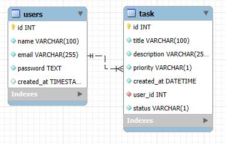

# Sistema de Gerenciamento de Tarefas
Utilizando:
 - Spring Web;
 - Bean Validation;
 - Optional;

	O Optional<T> representa um objeto que pode ou não conter valor. Em vez de retornar null, usamos Optional<T> para indicar que o valor pode esta presente ou ausente. Exemplos de uso:
	
	Na classe *UsersService*:
	```
	public interface UsersRepository extends CrudRepository<Users, Integer>{
		Optional<Users> findByEmail(String email);
	}
	```
	Na classe *UsersService*
	```
	public UsersResponse addNewUser(Users newUsers) {	    
		usersRepository.findByEmail(newUsers.getEmail())
			.ifPresent(user ->{
				throw new UsersConflictException("Email " + user.getEmail() + " já cadastrado.");
			});
	
		// continuação do método
	}
	```
	Também foi utilizado na classe *TaskService*:
	```
	public TaskResponse addNewTask(TaskDTO taskDTO) {		
		Users user = usersRepository.findById(taskDTO.getUser_id())
				.orElseThrow(() -> new UsersNotFoundException("Código usuário " + taskDTO.getUser_id() + " não encontrado.")); 
		
		// continuação do método

	}
	```
	Neste caso foi utilizado *orElseThrow()*, que lança uma exceção ao obter um resultado vazio.

 - Spring Data JPA;
 - Spring Boot Dev Tool;
 - MySQL Driver;

## Cadastro de usuário

```
http://localhost:9090/users

{
    "name" :"Marcelo",
    "email": "marceloformentini@gmail.com",
    "password":"123456"
}
```

## Cadastro Task
```
http://localhost:9090/task

{
    "title" :"Cadastrar de usuário",
    "description": "Fazer o cadastro de novos usuários para ter controle de entrada/saída na portaria",
    "priority":"L",
    "status": "P",
    "user_id": 1
}
```

## Banco de dados
**UML** - Unified Modeling Language (Linguagem de Modelagem Unificada)



**Coluna status (Status da Tarefa)** - Esta coluna indicará o andamento da tarefa. Podemos usar as seguintes opções:

| Valor | Significado                |
|-------|----------------------------|
|   P   | Pendente (Pending)         |
|   I   | Em andamento (In Progress) |
|   C   | Concluído (Completed)      |
|   A   | Cancelado (Aborted)        |


**Coluna priority (Prioridade da Tarefa)** - Esta coluna indicará a importância da tarefa. Podemos definir os seguintes valores:

| Valor | Significado      |
|-------|------------------|
|   L   | Baixa (Low)      |
|   M   | Média (Medium)   |
|   H   | Alta (High)      |
|   U   | Urgente (Urgent) |